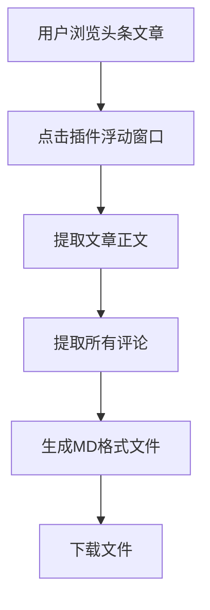

## 1. Product Overview
头条评论及正文提取器是一款浏览器插件，用于提取今日头条文章的正文和所有评论，并支持多种格式导出。
- 主要解决用户需要保存和分析头条文章内容及评论的问题，目标用户为内容创作者、研究人员和普通用户。
- 产品价值在于提供便捷的内容提取和导出功能，支持多种格式，满足不同用户的需求。

## 2. Core Features

### 2.1 User Roles
| Role | Registration Method | Core Permissions |
|------|---------------------|------------------|
| 普通用户 | 无需注册 | 使用插件的所有功能 |

### 2.2 Feature Module
1. **浮动窗口**：插件主界面，提供开始抓取按钮
2. **内容提取**：提取文章正文和所有评论
3. **格式导出**：支持导出为CSV、DOCX、MD格式

### 2.3 Page Details
| Page Name | Module Name | Feature description |
|-----------|-------------|---------------------|
| 浮动窗口 | 主界面 | 显示插件名称、作者信息，提供开始抓取按钮，支持点击开始自动抓取并导出MD格式 |
| 内容提取 | 正文提取 | 自动识别并提取文章正文内容 |
| 内容提取 | 评论提取 | 自动识别并提取所有评论内容，包括评论数量统计 |
| 格式导出 | MD格式 | 导出为MD格式，正文及评论为一级标题，评论标题下显示评论数量为二级标题，评论内容之间用分割线隔开 |
| 格式导出 | CSV格式 | 导出为CSV格式，包含文章标题、正文、评论等字段 |
| 格式导出 | DOCX格式 | 导出为DOCX格式，保留文章结构和评论 |

## 3. Core Process
用户在浏览今日头条文章时，点击插件的浮动窗口，插件自动提取文章正文和所有评论，然后生成并下载MD格式文件，文件名为：网页标题_正文及评论.md。

## 4. User Interface Design
### 4.1 Design Style
- 主色调：深蓝色 (#1a2b6d) 和亮蓝色 (#3498db)
- 辅助色：金色 (#f1c40f) 和紫色 (#9b59b6)
- 按钮风格：3D效果，圆角设计，悬停时有发光效果
- 字体：科技感字体，主标题使用粗体，正文使用常规字体
- 布局风格：悬浮窗口，半透明效果，具有未来感
- 图标风格：科技感图标，带有发光效果

### 4.2 Page Design Overview
| Page Name | Module Name | UI Elements |
|-----------|-------------|-------------|
| 浮动窗口 | 主界面 | 背景：深蓝色渐变，带有科技感纹理；标题：白色粗体，带有发光效果；按钮：金色边框，悬停时发光；作者信息：白色小字 |
| 内容提取 | 进度指示器 | 圆形进度条，带有科技感动画效果 |
| 格式导出 | 导出成功提示 | 绿色对勾图标，带有发光效果 |

### 4.3 Responsiveness
- 浮动窗口大小固定，适应不同浏览器窗口
- 支持主流浏览器：Chrome、Firefox、Edge

### 4.4 3D Scene Guidance
- 浮动窗口背景使用3D渐变效果
- 按钮点击时有3D反馈效果
- 进度指示器使用3D旋转动画