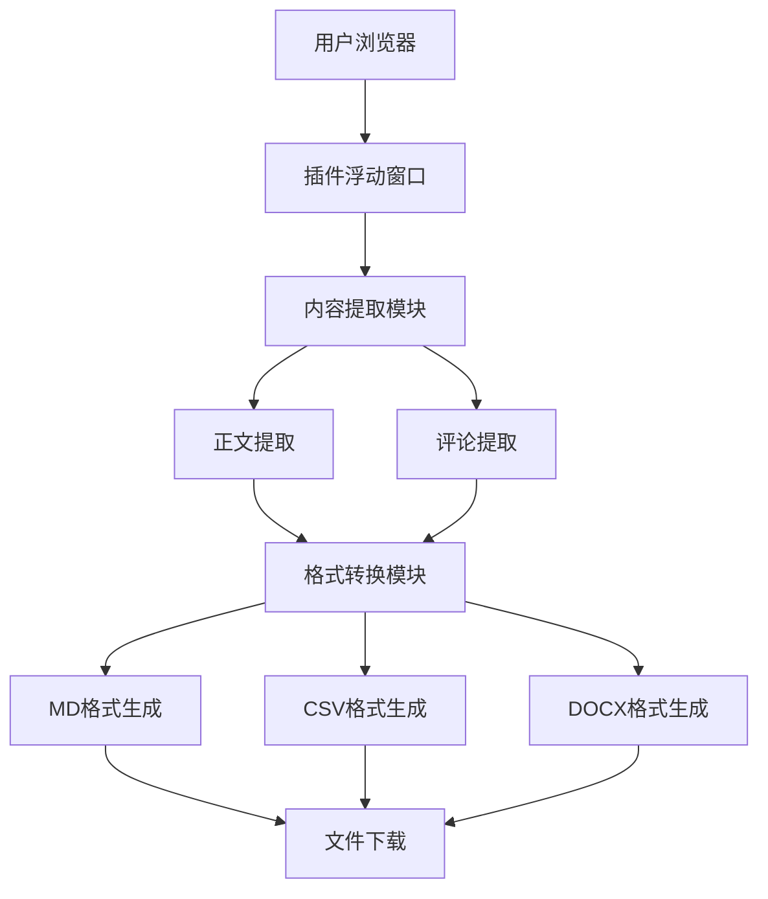

## 1. Architecture Design


## 2. Technology Description
- 前端：HTML5 + CSS3 + JavaScript
- 构建工具：无（浏览器插件原生开发）
- 存储：浏览器本地存储
- 外部依赖：
  - FileSaver.js（用于文件下载）
  - html-docx-js（用于生成DOCX格式）
  - PapaParse（用于生成CSV格式）

## 3. File Structure
```
├── manifest.json          # 插件配置文件
├── background.js          # 后台脚本
├── content.js             # 内容脚本
├── popup.html             # 浮动窗口HTML
├── popup.js               # 浮动窗口脚本
├── styles.css             # 样式文件
└── lib/                   # 依赖库
    ├── FileSaver.min.js
    ├── html-docx-js.min.js
    └── papaparse.min.js
```

## 4. Core Modules
### 4.1 内容提取模块
- 功能：提取文章正文和评论
- 实现方式：使用DOM操作，通过选择器定位文章正文和评论元素
- 处理逻辑：
  1. 识别文章标题
  2. 提取正文内容
  3. 提取评论列表
  4. 统计评论数量

### 4.2 格式转换模块
- 功能：将提取的内容转换为不同格式
- 实现方式：
  - MD格式：使用字符串拼接生成Markdown格式
  - CSV格式：使用PapaParse库生成CSV
  - DOCX格式：使用html-docx-js库生成DOCX

### 4.3 文件下载模块
- 功能：将生成的文件下载到本地
- 实现方式：使用FileSaver.js库实现文件下载

## 5. API Definitions
### 5.1 浏览器API
- chrome.runtime.onMessage：用于内容脚本和后台脚本之间的通信
- chrome.downloads.download：用于下载文件
- chrome.storage.local：用于存储插件设置

### 5.2 内部函数
- extractContent()：提取文章内容
- extractComments()：提取评论内容
- generateMarkdown()：生成Markdown格式
- generateCSV()：生成CSV格式
- generateDOCX()：生成DOCX格式
- downloadFile()：下载文件

## 6. Data Flow
1. 用户点击浮动窗口的开始抓取按钮
2. 插件向内容脚本发送提取请求
3. 内容脚本提取文章正文和评论
4. 内容脚本将提取的内容发送给后台脚本
5. 后台脚本生成指定格式的文件
6. 后台脚本触发文件下载

## 7. Technical Constraints
- 插件需要在manifest.json中声明必要的权限，包括activeTab、downloads等
- 由于浏览器安全限制，插件只能访问当前活动标签页的内容
- 提取评论时可能需要处理分页加载的情况
- 不同浏览器的插件API可能略有差异，需要进行兼容性处理